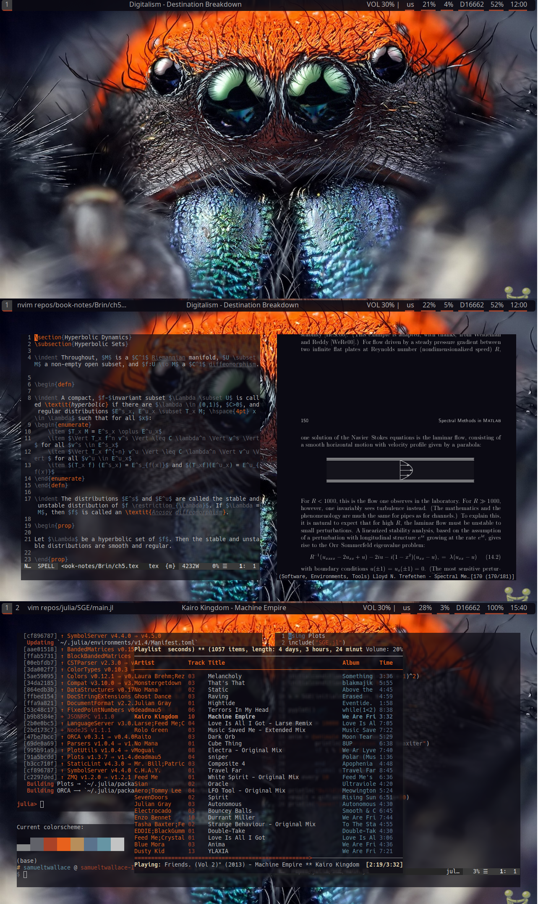

# dotfiles-inspiron
Selected folders from my .config folder on my Insipiron-5558.

Includes configs for alacritty, polybar, i3, neovim, and a couple of homemade scripts of my own.

You can also curl my neofetch! all you need to do is 

```
curl https://raw.githubusercontent.com/samueltwallace/dotfiles-inspiron/master/neofetch
```

## Screenshots

